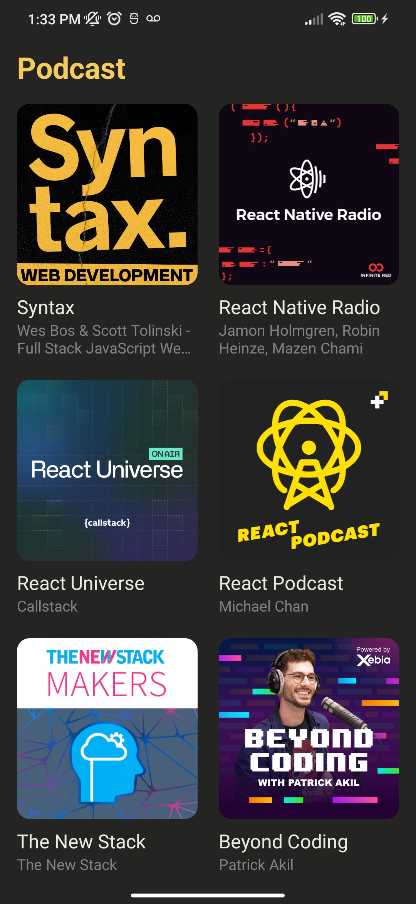
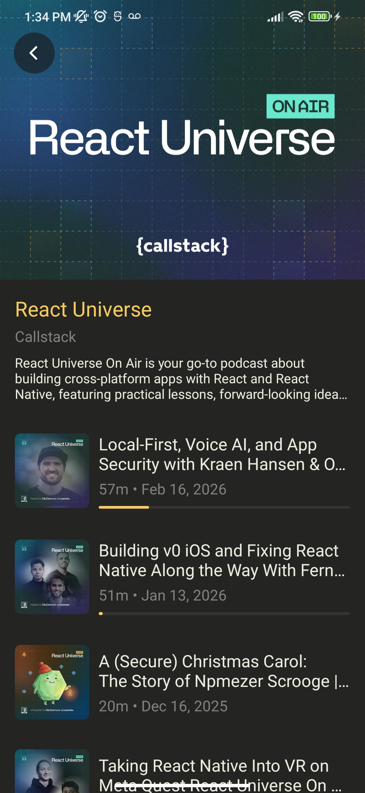
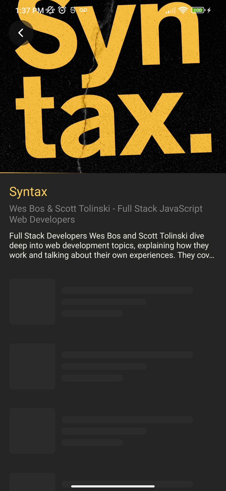
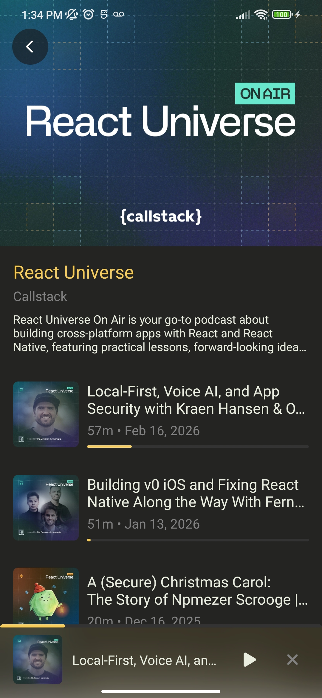
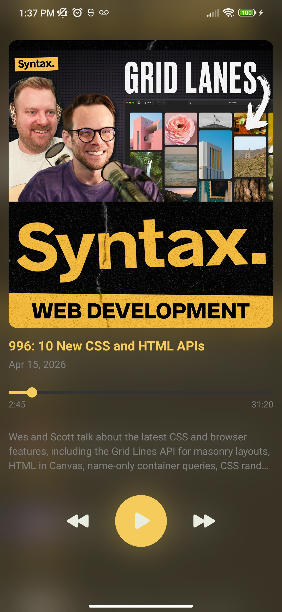

# 🎧 Podcast App (React Native / Expo)

A cross-platform podcast streaming app focused on **high-performance UI, smooth animations, and scalable frontend architecture**.

Built as a portfolio project for a Front-End Engineer role.

---

## ✨ Features

* Browse curated podcasts
* Fetch episodes from RSS feeds
* Stream audio playback
* Mini player + full player experience
* Track playback progress (SQLite)
* Smooth animations and transitions

---

## 🎬 UI & Interaction Highlights

* Shared element transitions (Home → Detail)
* Animated list entry transitions (Home / Detail)
* Mini player and full player views
* Blur/glass UI controls
* Image caching with placeholders

---

## ⚡ Performance Optimizations

* RSS parsing via `fast-xml-parser`
* In-memory caching (Map-based)
* Prefetch on user interaction
* Image caching (`expo-image`, disk cache + placeholders)

### 🎯 Loading Strategy

* Instant rendering when data is cached
* Skeleton loading used selectively for podcast detail (slower RSS feeds)
* Avoided full-screen loading states to preserve UI continuity and transitions

---

## 🧱 Architecture

### Structure

```bash
src/
  components/
  screens/
  navigation/
  services/
  context/
  hooks/
  data/
  theme/
  types/
```

### Key Principles

* Separation of concerns
* Reusable components
* Centralized player state (Context API)
* Service layer for data fetching and caching

---

## 🎨 Design System

Custom lightweight design system:

* Colors
* Spacing
* Typography (font sizes & hierarchy)
* Reusable UI components

---

## 🎧 Audio System

* Built with `expo-av`
* Global player context
* Sync between:

  * episode list
  * mini player
  * full player

---

## 💾 Persistence

* SQLite used for:

  * playback progress tracking

---

## 📱 Tech Stack

* React Native (Expo)
* TypeScript
* React Navigation
* Reanimated 4
* Expo AV (audio)
* Expo Image (caching)
* SQLite
* fast-xml-parser

---

## 📸 Screenshots

### Home


### Podcast Detail


### Detail (Loading State)


### Mini Player


### Full Player


---

## 🎥 Demo

https://www.loom.com/share/d9fc64cc382c431a8cfc182be61473bd

---

## 🚀 Getting Started

```bash
npm install
npx expo run:android
```

---


## 💡 Notes

* Focused on real-world streaming app patterns
* Designed to demonstrate frontend architecture and UI polish
* Optimized for performance and perceived speed

---

## 👤 Author

Eduardo Saldaña
